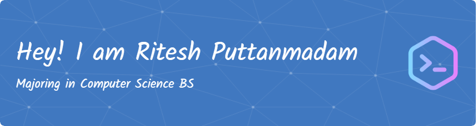

# Hi, I'm Ritesh Puttanmadam! 👋

I'm a passionate software engineer dedicated to transforming ideas into robust, scalable applications. I love turning coffee into code ☕ and tackling challenges that drive innovation. I have strong technical skills and an academic background in databases and different programming languages such as **Java, Python, C/C++, SQL, HTML, CSS,** and **JavaScript**. This foundation has empowered me to excel in building solutions that are both efficient and impactful.

In my journey, I've embraced frameworks and tools like **React, Node.js, Django,** and various cloud platforms, always striving to stay ahead in the ever-evolving tech landscape. Beyond coding, I contribute to open source projects, share insights on tech trends, and continuously seek opportunities to learn and grow.

When I'm not immersed in code, I'm brainstorming new ideas 💡 or exploring the latest developments in technology. I'm always open to collaborations and new challenges—**let's connect and build something amazing together!** 🚀

---

## 🔧 Tech & Tools

)

---

